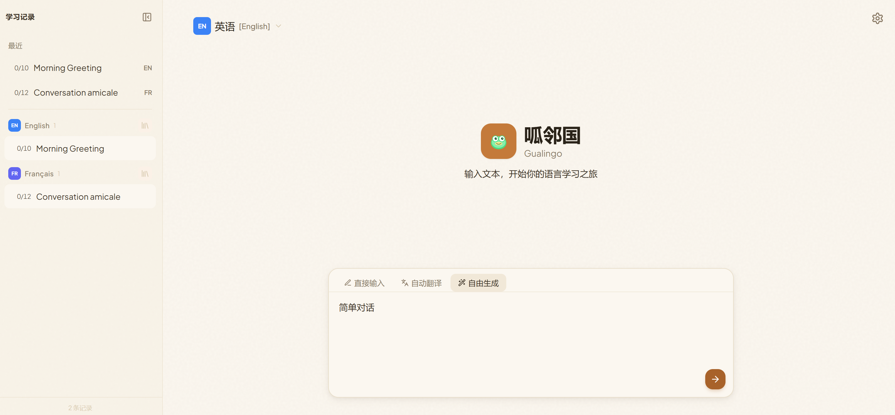
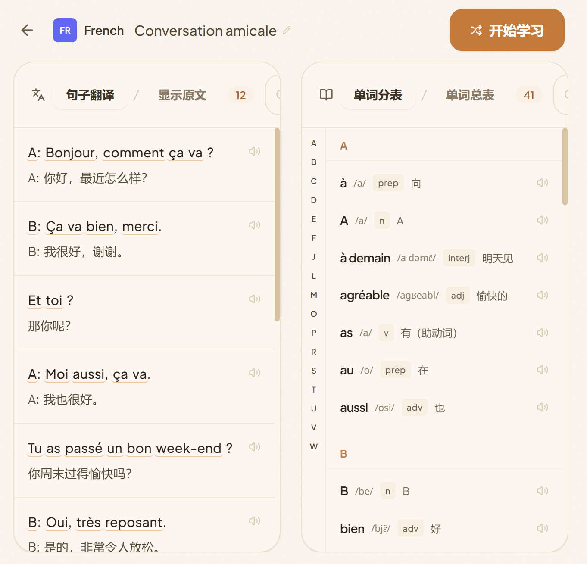
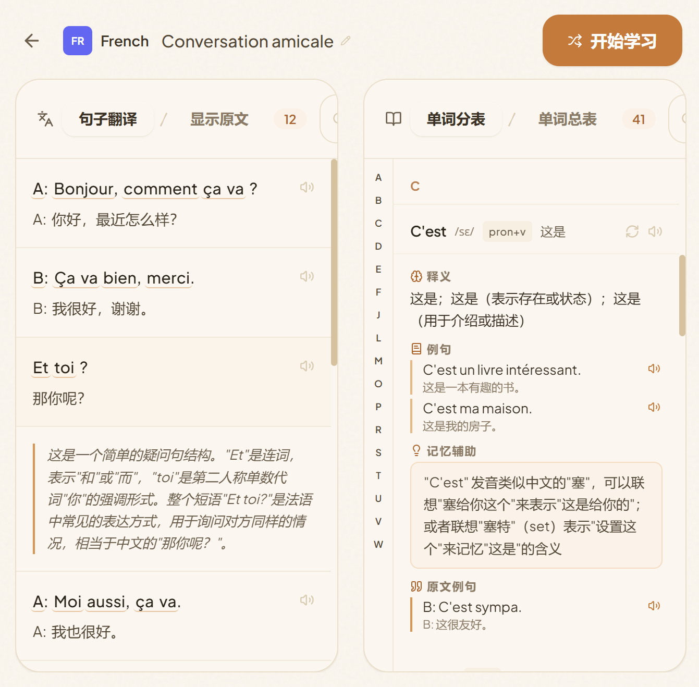
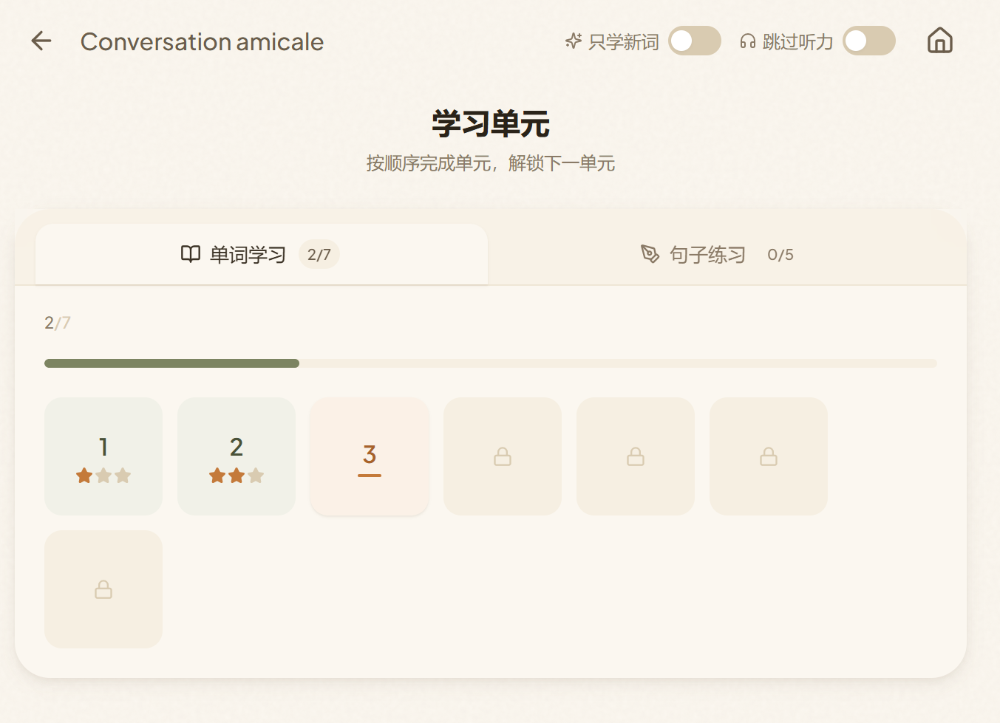
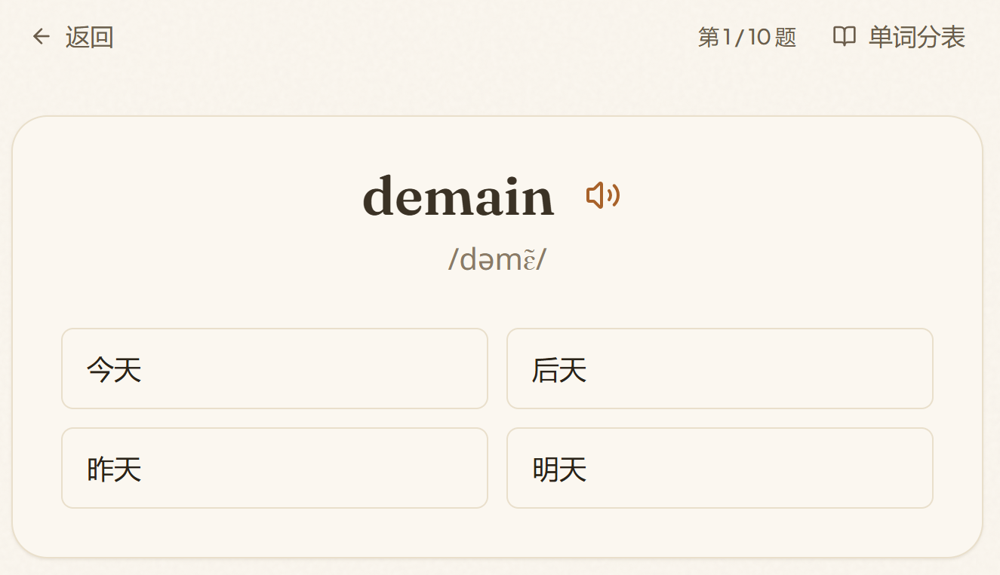
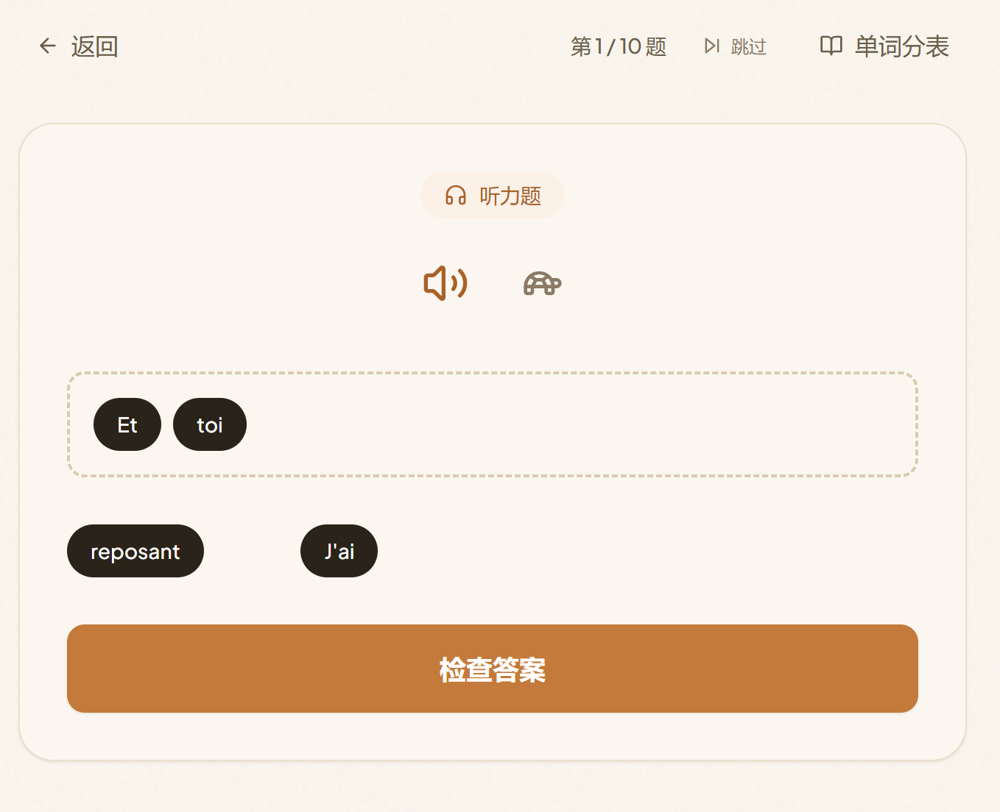
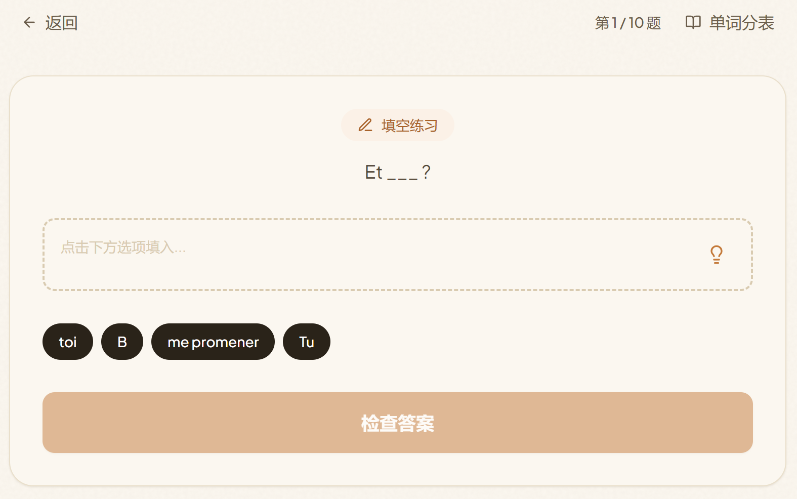

[README.md](https://github.com/user-attachments/files/28637275/README.md)
<div align="cente<div align="center">

# 🐸 呱邻国

**完全由 AI 驱动。输入 API，实现语言自由。**

[](https://react.dev)
[](https://fastapi.tiangolo.com)
[](https://python.org)
[](LICENSE)

</div>

---

## 多邻国做不到的，呱邻国做到了

| 多邻国的困境 | 呱邻国的解法 |
|-------------|-------------|
| **没有单词表，复习无门** | 自动生成完整词汇表，支持字母索引、搜索、逐词详情，随时查阅每个单词的释义、音标、词形变化和例句 |
| **做题时想查其它单词** | 学习过程中随时打开单词分表，查看任意单词的释义和详情，不打断学习节奏 |
| **学了也很难用上** | 你提供什么素材就学什么——歌词、新闻、台词、论文，学到的就是你真正会遇到的 |
| **小众语种不支持** | 支持任意语言互学，AI 自动检测语种，120+ 种语言 TTS 朗读，不再受限于平台资源 |

---

## 呱邻国是什么？

呱邻国是一个 AI 驱动的沉浸式外语学习平台。你提供任何文本，AI 自动生成词汇表、分句翻译和多种练习题，配合语音朗读，把每一段文字都变成你的专属学习材料。

**任何语言 → 任何语言，你的素材你做主。**

**只需一个 API Key，无需数据库，纯 LLM 能力驱动一切。**

---

## 主要页面

### 主页 & 输入



三种输入模式，覆盖所有学习场景：
- **直接输入** — 粘贴外语文本，AI 自动检测语言、分句翻译、提取词汇
- **自动翻译** — 输入母语文本，AI 翻译成目标语言后再学习
- **自由生成** — 告诉 AI 你想学什么主题，自动生成学习内容

### 字典页



左侧句子翻译，右侧词汇表，点击下划线单词即可查看详情。支持字母索引快速定位，每个单词都有音标、词性、释义、词形变化和例句。



单词详情支持刷新重新生成，记忆辅助帮助联想记忆。

### 学习单元



两阶段学习体系，单元逐步解锁，完成后获得星级评价。支持"只学新词"和"跳过听力"开关，按需定制学习节奏。

---

## 题型演示

### 阶段一 · 词汇认知

| 题型 | 截图 | 说明 |
|------|------|------|
| 单词选择 |  | 四选一选择题，看单词选释义，配合语音朗读和音标 |
| 句子翻译 |  | 看源语言句子，从母语词语中拼出翻译 |
| 听力理解 |  | 听句子，从词语中拼出听到的内容，支持常速/慢速切换 |

### 阶段二 · 综合训练

| 题型 | 截图 | 说明 |
|------|------|------|
| 遮蔽填空 |  | 句子中挖空关键词，从选项中选择正确答案 |
| 翻译重组 |  | 看母语翻译，从目标语言词语中还原原句 |

每个单元 10 道题，答错的题自动进入错题回顾，直到掌握为止。

---

## 🚀 快速开始

### 环境要求

- Python 3.10+
- Node.js 18+
- 一个 LLM API Key（支持 OpenAI 兼容接口，如 SiliconFlow、DeepSeek 等）

### 安装与启动

```bash
# 1. 安装后端依赖
cd backend
pip install -r requirements.txt

# 2. 启动后端
uvicorn main:app --reload --host 0.0.0.0 --port 8000

# 3. 安装前端依赖
cd ../frontend
npm install

# 4. 启动前端
npm run dev
```

打开 http://localhost:5173 ，点击右上角 ⚙️ 设置填入你的 API Key，就可以开始学习了。

---

## 🛠 技术栈

| 层 | 技术 |
|----|------|
| 前端 | React 18 · Vite · TailwindCSS · Framer Motion · Web Speech API |
| 后端 | FastAPI · Uvicorn · OpenAI 兼容 LLM API |
| 存储 | 本地文件系统（零配置，开箱即用） |

---

## 📖 使用流程

```
输入文本 → AI 分句翻译 → 生成词汇表 → 阶段一：学单词 → 阶段二：练句子 → 错题回顾
```

1. **输入文本**：直接粘贴、翻译成目标语言、或让 AI 生成
2. **浏览字典**：查看分句翻译和词汇释义，随时查阅任意单词
3. **阶段一**：单词选择、句子翻译、听力理解
4. **阶段二**：遮蔽填空、翻译重组
5. **错题回顾**：答错的题自动收集，强化练习直到掌握

---

## ⚙️ 配置

所有配置通过界面设置完成，无需编辑配置文件：

- **API Key**：支持多组配置轮询，限速自动切换
- **母语**：选择界面显示语言
- **每页数量**：控制词汇表每页显示的单词数
- **重试间隔**：API 限速后的等待时间

---

## 📄 许可

[MIT License](LICENSE)
r">

# 🐸 呱邻国

**完全由 AI 驱动。输入 API，实现语言自由。**

[](https://react.dev)
[](https://fastapi.tiangolo.com)
[](https://python.org)
[](LICENSE)

</div>

---

## 你是不是也有这些困扰？

- **想学一门语言，但教材太无聊** —— 课本里的句子你永远用不上，你真正想学的是那首歌的歌词、那篇文章的表达
- **找到了好素材，却不知道怎么学** —— 一篇外文新闻摆在面前，查完词典还是看不懂，查了就忘
- **市面上的 App 只教固定课程** —— 你想学日语，但 Duolingo 只会教你"すみません"，你想学的是动漫台词
- **界面语言不是你的母语** —— 你的母语不是英语或中文，几乎所有语言学习 App 都不支持你的语言

**呱邻国就是为了解决这些问题而生的。**

---

## 呱邻国是什么？

呱邻国是一个 AI 驱动的沉浸式外语学习平台。你提供任何文本，AI 自动生成词汇表、分句翻译和多种练习题，配合语音朗读，把每一段文字都变成你的专属学习材料。

**任何语言 → 任何语言，你的素材你做主。**

**只需一个 API Key，无需数据库，纯 LLM 能力驱动一切。**

---

## 它如何满足你的需求？

### 🎯 "我有素材，想直接学" → 直接输入模式

粘贴一篇文章、一首歌词、一段新闻、一集台词——任何外语文本丢进来，AI 自动检测语言、分句翻译、提取词汇，为你量身定制学习内容。

### 🌐 "我想用母语素材来学外语" → 翻译学习模式

输入你母语的文本，AI 翻译成你想学的语言，然后基于翻译后的文本生成词汇和练习。你熟悉的素材，变成你学外语的起点。

### ✨ "我没有素材，帮我生成" → AI 生成模式

告诉 AI 你想学什么主题（比如"日常点咖啡对话"、"旅行问路场景"），AI 自动生成目标语言的文本，然后开始学习。没有素材也能学。

### 🗣️ "我想练听力" → 语音朗读

基于浏览器原生 TTS，支持 120+ 种语言。单词和句子都能朗读，常速/慢速自由切换。阶段二还有专门的听力理解练习。

### 🌍 "我的母语不是英语/中文" → 任意语言界面

选择你的母语，整个界面自动翻译为该语言。不管你的母语是什么，都能无障碍使用。

### 📖 "我想系统复习" → 两种学习阶段 + 错题回顾

| 阶段 | 内容 | 题型 |
|------|------|------|
| **阶段一 · 词汇认知** | 单词卡片 + 句子翻译 | 单词选择（四选一）、句子翻译选择 |
| **阶段二 · 综合训练** | 听力 + 填空 + 重组 | 听力理解、遮蔽句子填空、翻译重组 |

每个单元 10 道题，完成后获得 ⭐ 星级评价，答错的题自动进入错题回顾，直到掌握为止。

---

## 🚀 快速开始

### 环境要求

- Python 3.10+
- Node.js 18+
- 一个 LLM API Key（支持 OpenAI 兼容接口，如 SiliconFlow、DeepSeek 等）

### 安装与启动

```bash
# 1. 安装后端依赖
cd backend
pip install -r requirements.txt

# 2. 启动后端
uvicorn main:app --reload --host 0.0.0.0 --port 8000

# 3. 安装前端依赖
cd ../frontend
npm install

# 4. 启动前端
npm run dev
```

打开 http://localhost:5173 ，点击右上角 ⚙️ 设置填入你的 API Key，就可以开始学习了。

---

## 🛠 技术栈

| 层 | 技术 |
|----|------|
| 前端 | React 18 · Vite · TailwindCSS · Framer Motion · Web Speech API |
| 后端 | FastAPI · Uvicorn · OpenAI 兼容 LLM API |
| 存储 | 本地文件系统（零配置，开箱即用） |

---

## 📖 使用流程

```
输入文本 → AI 分句翻译 → 生成词汇表 → 阶段一：学单词 → 阶段二：练句子 → 错题回顾
```

1. **输入文本**：直接粘贴、翻译成目标语言、或让 AI 生成
2. **浏览字典**：查看分句翻译和词汇释义
3. **阶段一**：逐个学习单词，完成句子翻译选择
4. **阶段二**：听力测验、填空练习、翻译重组
5. **错题回顾**：答错的题自动收集，强化练习直到掌握

---

## ⚙️ 配置

所有配置通过界面设置完成，无需编辑配置文件：

- **API Key**：支持多组配置轮询，限速自动切换
- **母语**：选择界面显示语言
- **每页数量**：控制词汇表每页显示的单词数
- **重试间隔**：API 限速后的等待时间

---

## 📄 许可

[MIT License](LICENSE)
